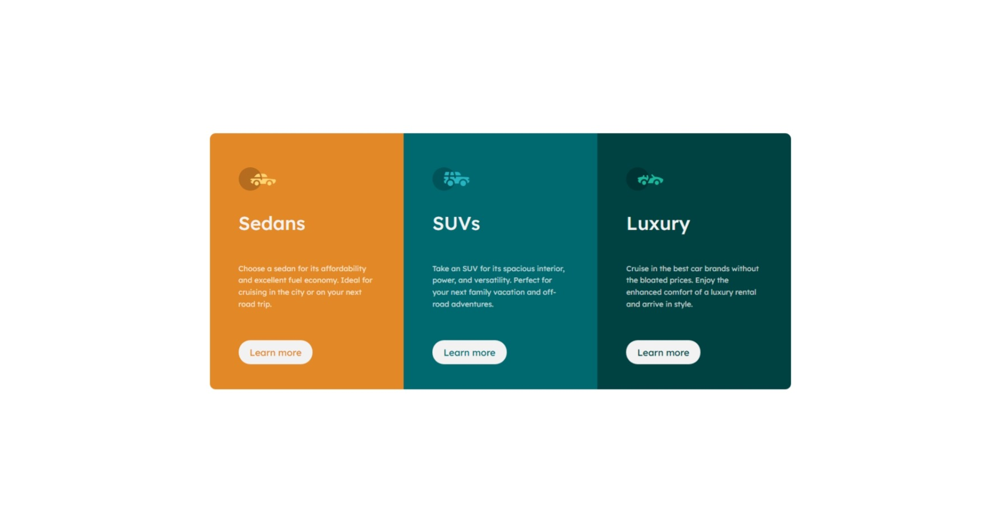

# Frontend Mentor - 3-column preview card component solution

This is a solution to the [3-column preview card component challenge on Frontend Mentor](https://www.frontendmentor.io/challenges/3column-preview-card-component-pH92eAR2-). Frontend Mentor challenges help you improve your coding skills by building realistic projects.

## Table of contents

- [Overview](#overview)
  - [The challenge](#the-challenge)
  - [Screenshot](#screenshot)
  - [Links](#links)
- [My process](#my-process)
  - [Built with](#built-with)
  - [What I learned](#what-i-learned)
  - [Continued development](#continued-development)
  - [Useful resources](#useful-resources)
- [Author](#author)

## Overview

### The challenge

Users should be able to:

- View the optimal layout depending on their device's screen size
- See hover states for interactive elements

### Screenshot

### Links

- Solution URL: [Add solution URL here](https://your-solution-url.com)
- Live Site URL: [Add live site URL here](https://your-live-site-url.com)

## My process

### Built with

- Semantic HTML5 markup
- CSS custom properties
- Flexbox
- SCSS

### What I learned

Whew 😥 I just learned the hard way to always remember to compile my SCSS. I forgot, and it caused so many issues—my code wasn’t even being compiled! Honestly, I’m just glad I still remember how to write HTML at all. I had to take a month-long break because of my year 2 college exams, so I’m actually proud I still remember how to turn on my PC!

### Continued development

I need to further study the `flex` property.

### Useful resources

- [The wesbos flexbox course](https://courses.wesbos.com/account/access/67ec48e105585f952acd8b4f/view/195969223) - The videos on the `flex`, `flex-shrink` and `flex-grow` helped me figure this out.

## Author

- Frontend Mentor - [@yourusername](https://www.frontendmentor.io/profile/uptowngirl757)
